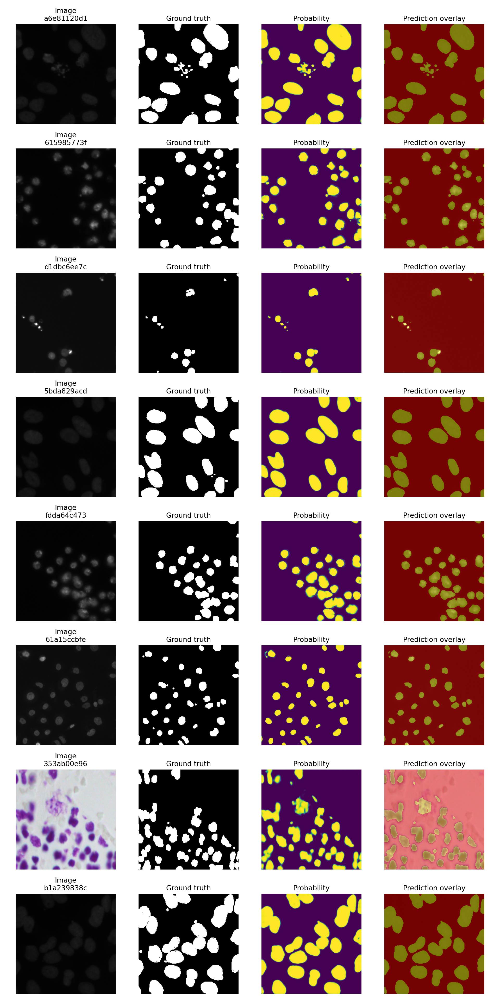
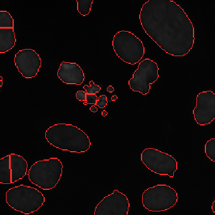

# NucleiScope

NucleiScope is a lightweight microscopy image-analysis project that segments
cell nuclei with a U-Net and converts the predicted mask into basic quantitative
measurements such as nucleus count, area, perimeter, and foreground density.

The project uses the annotated BBBC038 / 2018 Data Science Bowl training set.
It is intended as an educational image-analysis project and is not a medical
diagnostic system.

## Pipeline

```text
Microscopy image
      -> resize and augment
      -> U-Net semantic segmentation
      -> binary nucleus mask
      -> marker-controlled watershed instance separation
      -> overlay, count, measurements, and CSV output
```

## Repository structure

```text
nucleiscope/
|-- train.py           # training, validation, checkpointing, final test
|-- test.py            # reproducible held-out test evaluation
|-- predict.py         # single-image inference and basic quantification
|-- requirements.txt
|-- assets/            # selected result images for the public README
|-- results/           # compact JSON summaries from the reported experiment
|-- .gitignore
`-- README.md
```

The dataset and generated model files are deliberately excluded from GitHub.

## Dataset

Download `stage1_train.zip` from the official Broad Bioimage Benchmark
Collection BBBC038 page and extract it. Each sample must retain this structure:

```text
stage1_train/
`-- <sample_id>/
    |-- images/<sample_id>.png
    `-- masks/<one PNG per nucleus>
```

The code combines all instance masks belonging to one image into a binary
semantic-segmentation target. No manual annotation is required.

Dataset page: https://bbbc.broadinstitute.org/BBBC038

## Installation

Create and activate a Python environment in PowerShell:

```powershell
python -m venv .venv
.\.venv\Scripts\Activate.ps1
python -m pip install --upgrade pip
```

Install a CUDA-enabled build of PyTorch using the command generated by the
official installer for Windows, Pip, Python, and CUDA:

https://pytorch.org/get-started/locally/

Then install the remaining dependencies:

```powershell
pip install -r requirements.txt
```

Confirm GPU access:

```powershell
python -c "import torch; print(torch.cuda.is_available()); print(torch.cuda.get_device_name(0))"
```

The first result must be `True`.

## Training

The defaults are tuned for an RTX 3050 Laptop GPU with 6 GB VRAM: 256 x 256
images, batch size 4, a base width of 32 channels, and CUDA mixed precision.

First run a small end-to-end check:

```powershell
python train.py --data-dir "path\to\stage1_train" --epochs 1 --max-samples 20 --workers 0
```

Then run the full experiment:

```powershell
python train.py --data-dir "path\to\stage1_train" --epochs 25 --batch-size 4 --image-size 256
```

If CUDA runs out of memory, use `--batch-size 2`. On Windows, use `--workers 0`
if multiprocessing causes a worker error.

Training writes the following into `outputs/`:

- `best_model.pt`: checkpoint with the highest validation Dice score
- `last_model.pt`: final-epoch checkpoint
- `splits.json`: reproducible train, validation, and test sample IDs
- `history.csv`: metrics for every epoch
- `training_curves.png`: loss, Dice, and IoU curves
- `test_metrics.json`: automatic final held-out evaluation
- `test_predictions.png`: sample prediction visualizations
- `combined_masks/`: cached merged masks for faster later epochs

## Independent testing

`test.py` loads the exact test IDs saved during training, so the evaluation is
reproducible and does not create a new split.

```powershell
python test.py --data-dir "path\to\stage1_train" --checkpoint "outputs\best_model.pt" --splits "outputs\splits.json"
```

Testing produces:

- `outputs/test/test_summary.json`
- `outputs/test/per_image_metrics.csv`
- `outputs/test/test_examples.png`
- `outputs/test/predicted_masks/`

The reported metrics are mean per-image Dice, IoU, precision, recall, and pixel
accuracy. Do not tune the model using this held-out test result; use validation
metrics for model decisions.

## Predict and quantify one image

```powershell
python predict.py --image "path\to\microscopy_image.png" --checkpoint "outputs\best_model.pt"
```

This produces:

- `prediction_mask.png`
- `instance_labels.png`
- `prediction_overlay.png`
- `nuclei_measurements.csv`
- `summary.json`

Quantification uses a distance transform and marker-controlled watershed to
separate touching nuclei before measuring each instance. The defaults are a
5-pixel minimum distance between candidate centres and a 0.05 relative peak
threshold. These parameters should be tuned on validation images when the image
scale or microscope magnification changes:

```powershell
python predict.py --image "path\to\image.png" --peak-min-distance 5 --peak-threshold-relative 0.05
```

## Evaluation protocol

- Fixed random seed: 42
- Split: 70% training, 15% validation, 15% held-out testing
- Loss: binary cross-entropy plus soft Dice loss
- Model selection: highest validation Dice
- Final metrics: held-out test Dice and IoU
- Prediction threshold: 0.5

## Results

The following mean per-image results were obtained on 102 held-out test images.
The split was created once with seed 42 and preserved in `splits.json`.

| Metric | Held-out test result |
|---|---:|
| Dice | 0.8684 |
| IoU | 0.7966 |
| Precision | 0.8939 |
| Recall | 0.8813 |
| Pixel accuracy | 0.9735 |

The pooled pixel-level evaluation produced a Dice score of 0.8918 and IoU of
0.8047. The conservative mean per-image values above are used when reporting the
project.

### Training behaviour


### Held-out predictions



### Watershed quantification example

On one held-out example containing 30 annotated nuclei, direct connected
components produced 23 regions and marker-controlled watershed produced 29
instances.




Compact machine-readable summaries are provided in `results/`. The dataset,
checkpoints, and full generated `outputs/` directory are not committed.

## Limitations

- All images are resized to 256 x 256 for the baseline experiment.
- Watershed improves separation of touching nuclei but can still merge or split
  difficult clusters.
- Pixel area is not a physical measurement without microscope calibration.
- Performance on BBBC038 does not establish clinical validity.

## Reproducibility

Keep `splits.json`, the final metric JSON, training curves, dependency versions,
and the chosen checkpoint with the experiment. Large datasets and model weights
should be stored as release assets or external links rather than committed to
the Git repository.
