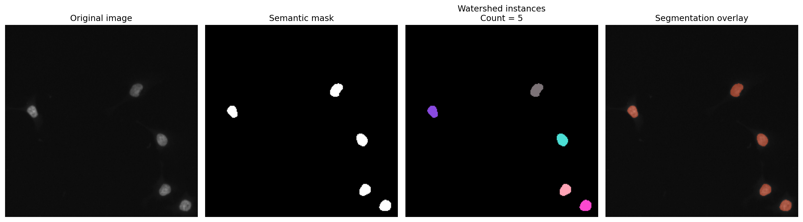
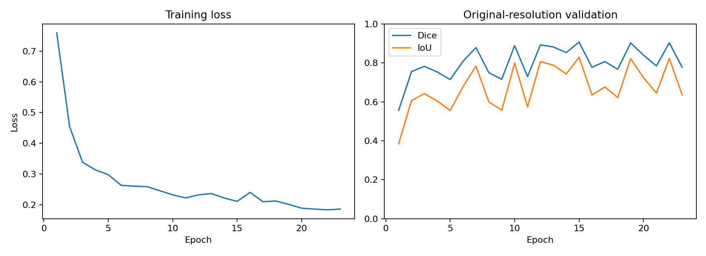
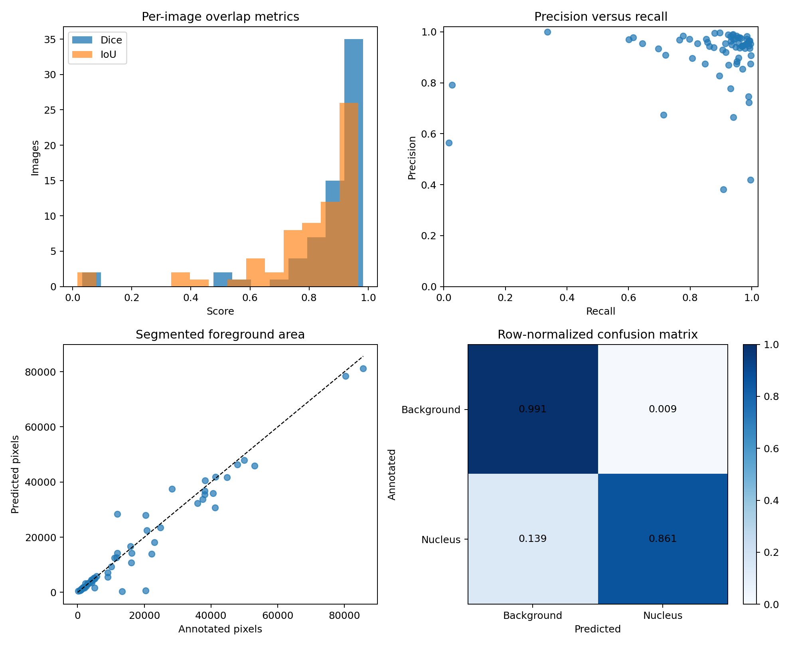
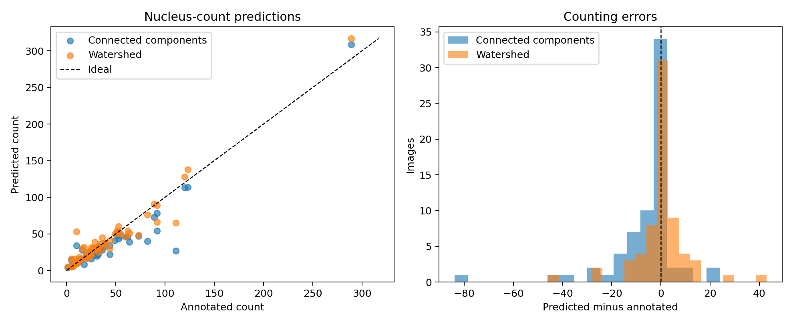
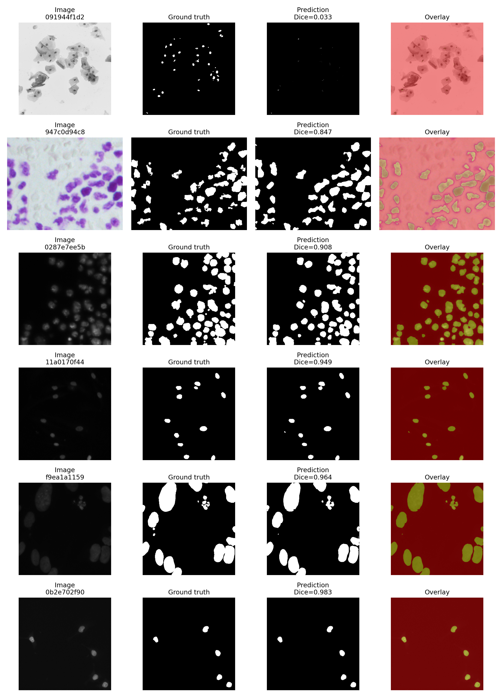
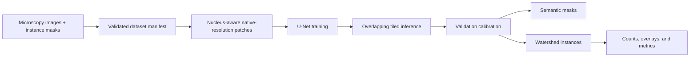

<h1 align="center">NucleiScope-UNet</h1>

<p align="center">
  <strong>Native-resolution nuclei segmentation, instance separation, and cell counting with U-Net</strong>
</p>

<p align="center">
  <a href="https://github.com/Prudhvi0619/NucleiScope-UNet/actions/workflows/quality.yml"></a>
  
  
  <a href="LICENSE"></a>
</p>

<p align="center">
  
</p>

NucleiScope-UNet is an end-to-end microscopy pipeline for turning heterogeneous
2-D images into semantic masks, separated nucleus instances, overlays, and
machine-readable counts. It trains on pixel-preserving patches and reconstructs
predictions at the source image's original resolution.

## At a glance

| | |
|---|---|
| **Task** | Nuclei segmentation, instance separation, and quantification |
| **Model** | Patch-wise U-Net with BCE + soft Dice loss |
| **Inference** | Overlapping native-resolution tiles with tapered blending |
| **Post-processing** | Validation-calibrated thresholding, cleanup, and watershed |
| **Evaluation** | Semantic, instance, and counting metrics with bootstrap intervals |
| **Reliability** | Deterministic runs, dataset fingerprints, checkpoint-bound calibration |

## Highlights

- Preserves the spatial scale of every source image—no full-image resizing.
- Samples nuclei-aware training patches without over-favoring large instances.
- Supports 8-bit and 16-bit microscopy images while rejecting ambiguous TIFF stacks.
- Reconstructs smooth full-resolution probability maps from overlapping tiles.
- Separates touching nuclei and reports both semantic and object-level performance.
- Produces masks, labels, overlays, probability maps, CSV/JSON metrics, and counts.
- Runs on CUDA for training and supports CPU smoke tests and small experiments.
- Protects reproducibility with split fingerprints, content hashes, saved RNG state,
  immutable resume settings, and checkpoint-matched calibration.

## Reference benchmark

A previous run on a held-out 67-image split produced the following reference results:

| Metric | Result |
|---|---:|
| Mean Dice | **0.870** |
| Median Dice | **0.932** |
| Pooled Dice | **0.888** |
| Mean IoU | **0.799** |
| Mean precision | **0.905** |
| Mean recall | **0.873** |
| Mean pixel accuracy | **97.43%** |
| Mean MCC | **0.863** |
| Watershed count MAE | **6.12 nuclei** |
| Count Pearson correlation | **0.967** |

Watershed separation reduced the count MAE from **7.84** nuclei with connected
components alone to **6.12**.

<p align="center">
  
</p>

<p align="center">
  
  
</p>

<details>
<summary><strong>View predictions across different microscopy appearances</strong></summary>
<br>
<p align="center">
  
</p>
</details>

> **Benchmark provenance:** the compact figures and tables above are retained from
> the earlier experiment. The original checkpoint and dataset are not stored in Git,
> so these values should be treated as a reference baseline. A new run of the current
> pipeline creates fingerprinted, checkpoint-bound evidence suitable for reporting.
> See [results/README.md](results/README.md) and [REPRODUCIBILITY.md](REPRODUCIBILITY.md).

## Pipeline



1. Validate every image and instance annotation and fingerprint the dataset.
2. Split complete images before extracting any patches.
3. Train on pixel-preserving crops with deterministic augmentation and sampling.
4. Blend overlapping prediction tiles back into each native image canvas.
5. Select semantic and watershed settings using validation data only.
6. Evaluate the untouched test split and export visual and numerical artifacts.

## Quick start

### 1. Install

Python **3.10+** is supported by the source requirements. The exact CPU lock and
GitHub Actions use **Python 3.12**.

```bash
python -m venv .venv

# Windows
.venv\Scripts\activate

# macOS / Linux
source .venv/bin/activate

python -m pip install --upgrade pip
pip install -r requirements-lock-cpu.txt --extra-index-url https://download.pytorch.org/whl/cpu
```

For CUDA, install the PyTorch 2.4.1 build compatible with the machine first,
then install the remaining dependencies:

```bash
pip install torch==2.4.1 --index-url https://download.pytorch.org/whl/cu124
pip install -r requirements.txt
```

The CUDA index above is an example; choose the index that matches the installed driver.

### 2. Prepare the dataset

Download the [2018 Data Science Bowl dataset](https://www.kaggle.com/competitions/data-science-bowl-2018)
and preserve its instance-mask layout:

```text
data/stage1_train/
└── <sample_id>/
    ├── images/<sample_id>.png
    └── masks/<one lossless image per nucleus>
```

Every annotation must be nonempty, contain one connected nucleus, match its image
dimensions, and not overlap another instance mask.

### 3. Train

```bash
python train.py \
  --data-dir data/stage1_train \
  --output-dir outputs/run-001 \
  --epochs 30 \
  --patch-size 256 \
  --batch-size 4
```

Resume an interrupted run by repeating the original arguments and increasing
`--epochs`:

```bash
python train.py \
  --data-dir data/stage1_train \
  --output-dir outputs/run-001 \
  --epochs 40 \
  --patch-size 256 \
  --batch-size 4 \
  --resume outputs/run-001/last_model.pt
```

A resume is rejected if its data, split, or immutable training settings do not match.

### 4. Evaluate and calibrate

```bash
python test.py \
  --data-dir data/stage1_train \
  --checkpoint outputs/run-001/best_model.pt \
  --output-dir outputs/run-001-evaluation
```

Evaluation calibrates on the validation split before touching the test split. It
writes per-image metrics, bootstrap intervals, masks, 32-bit instance-label TIFFs,
overlays, and a calibration file bound to the checkpoint hash.

### 5. Predict a new image

```bash
python predict.py \
  --image path/to/image.tiff \
  --checkpoint outputs/run-001/best_model.pt \
  --calibration outputs/run-001-evaluation/calibration.json
```

Each prediction directory contains:

- semantic and cleaned binary masks;
- a 16-bit probability map;
- watershed instance labels and a colored instance map;
- a segmentation overlay and summary figure;
- `quantification.json` with object counts and image metadata.

## Repeated experiments

Run several training seeds on one fixed split:

```bash
python run_multi_seed.py \
  --data-dir data/stage1_train \
  --output-dir outputs/multi-seed \
  --seeds 41 42 43 \
  --split-seed 42
```

The runner produces per-seed results and an aggregate mean/standard-deviation summary.

## Repository map

```text
NucleiScope-UNet/
├── train.py                   # deterministic training and tiled inference
├── test.py                    # calibration and held-out evaluation
├── predict.py                 # prediction and quantification
├── postprocess.py             # cleanup and watershed separation
├── nuclei_io.py               # validated I/O, hashing, and mask cache
├── run_multi_seed.py          # repeated-seed experiments
├── tests/                     # unit and regression tests
├── assets/                    # README figures
├── results/                   # compact reference benchmark artifacts
├── MODEL_CARD.md              # intended use and limitations
├── REPRODUCIBILITY.md         # experiment reproducibility contract
└── .github/workflows/quality.yml
```

## Quality checks

```bash
python -m ruff check .
python -m pytest
```

The same checks run automatically on every push and pull request.

## Scope and limitations

- The model performs 2-D semantic segmentation followed by heuristic instance
  separation; it is not a learned instance-segmentation architecture.
- Performance outside the heterogeneous Data Science Bowl domain is not established.
- Physical area or diameter requires microscope pixel-size calibration.
- TIFF stacks must first be converted to an explicit slice or projection.
- A trained checkpoint is not included in the repository.

For responsible reuse, see the [model card](MODEL_CARD.md), the
[reproducibility contract](REPRODUCIBILITY.md), and the
[security policy](SECURITY.md).

## License

Released under the [MIT License](LICENSE).
